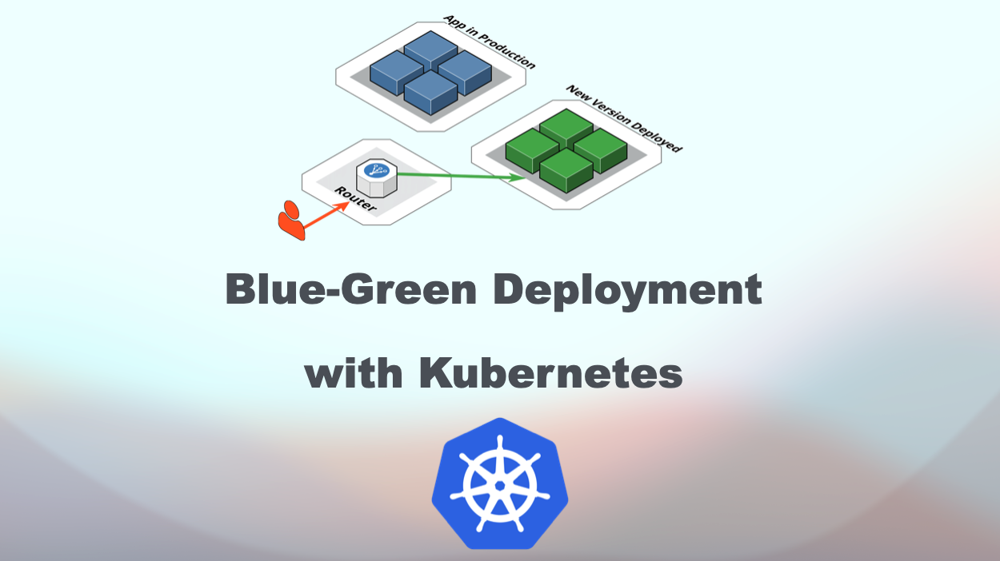
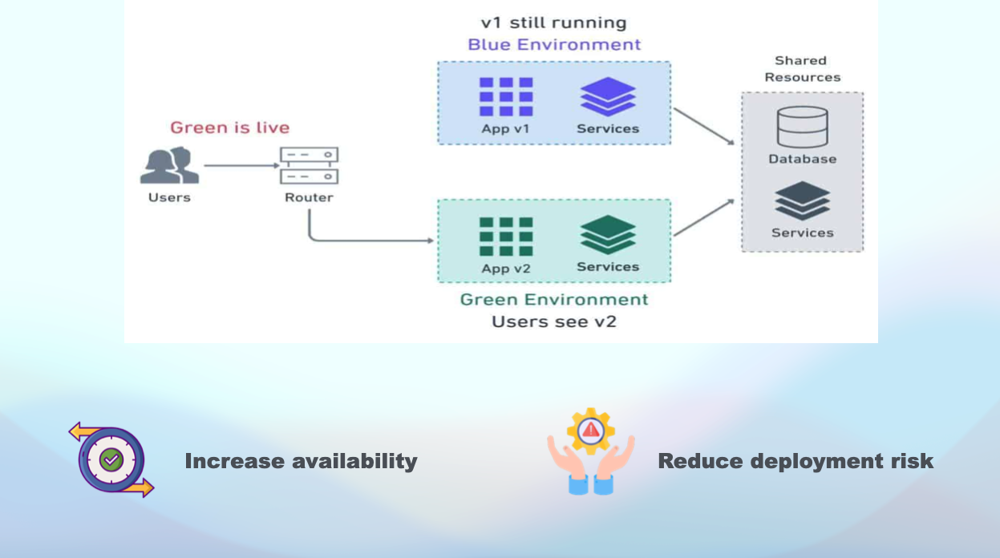
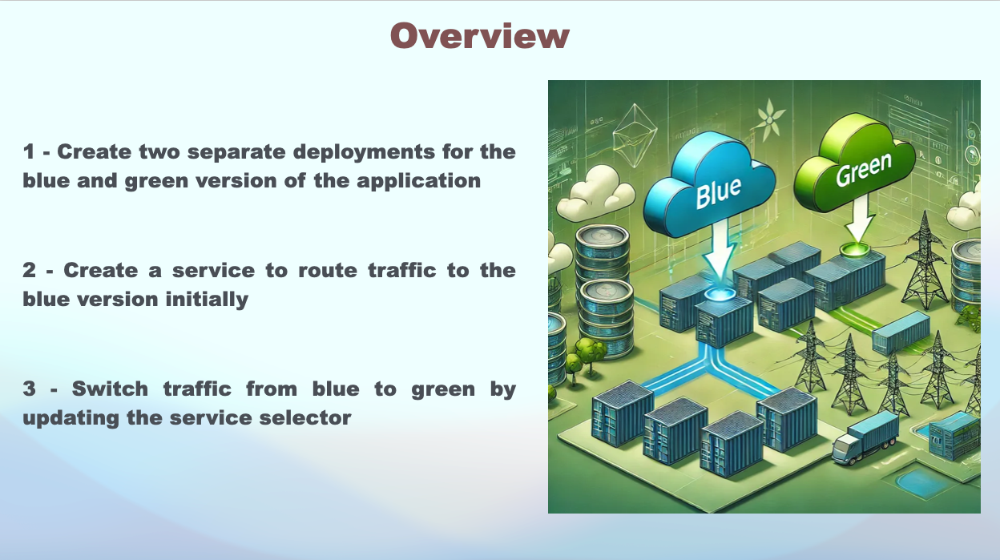
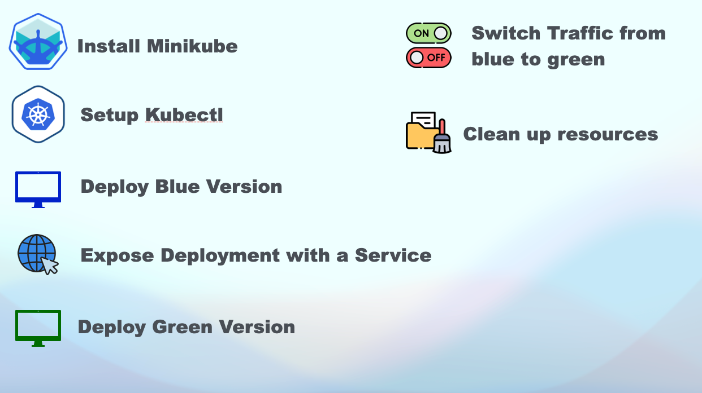

# 🚀 Blue Green Deployment with Kubernetes
[](https://www.linkedin.com/in/amine-maalej/)

[](https://www.youtube.com/watch?v=m4Pzl5FX0eU&t=249s)




Welcome to the repository for **demonstrating blue green deployment with kubernetes**!

## 🌟 Overview
we’ll perform a blue-green deployment on Kubernetes. This approach enables zero-downtime deployments by running two versions of an application (blue and green) and switching traffic between them.
We’ll use a Kubernetes Service to route traffic and demonstrate how to toggle between the two versions.

## 📝 Comprehensive Guide
For a detailed guide, please refer to the [Youtube video](https://www.youtube.com/watch?v=m4Pzl5FX0eU&t=249s).

## ✅ Slides

Slide 1            | Slide 2         | Slide 3        |
:------------------------:|:-----------------------:|:----------------------:|
  |  |  |

## 💻 Useful Commands & Links
### Install MiniKube
```
https://minikube.sigs.k8s.io/docs/start/?arch=%2Fmacos%2Farm64%2Fstable%2Fbinary+download
```
### Install Kubectl
```
https://kubernetes.io/docs/tasks/tools/
```

## Configure kubectl for Minikube 

```
kubectl config use-context minikube
```

## Apply Blue Deployment
```
kubectl apply -f blue-deployment.yaml

```
## Switch Traffic from Blue to Green

```
kubectl patch service example-service -p '{"spec":{"selector":{"app":"example-app","version":"green"}}}'
```

## Cleanup
```
kubectl delete deployment blue-deployment green-deployment
```
```
kubectl delete service example-service
```


Happy learning 📚


